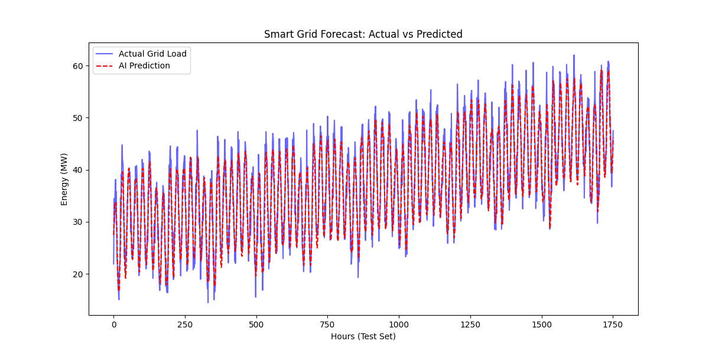

# ⚡ Smart Grid Energy Forecasting (LSTM)

**A Time-Series AI project that predicts city-wide power consumption to optimize grid stability.**

## 📌 Overview
As renewable energy sources (Solar/Wind) make the grid more unstable, accurate demand forecasting is critical. This project uses a **Long Short-Term Memory (LSTM) Neural Network** to predict the next 24 hours of energy demand based on historical load data.

**Key Engineering Concepts:**
* **Load Profiling:** Modeled daily and seasonal peaks (Morning ramp-up, Evening peak).
* **Time-Series AI:** Used Sliding Window techniques to teach the AI historical context.
* **Grid Stability:** Accurate forecasting helps prevents overloads and reduces blackouts.

## Actual Vs Predicted results



## 🧠 Model Architecture
*The AI looks at the past 24 hours to predict the next hour:*

```mermaid
graph LR
    A[Historical Data (24h)] --> B(LSTM Layer - Memory);
    B --> C(Dense Layer - Logic);
    C --> D[Predicted Load (MW)];
    
    style A fill:#f9f,stroke:#333,stroke-width:2px
    style B fill:#bbf,stroke:#333,stroke-width:2px
    style D fill:#9f9,stroke:#333,stroke-width:2px
